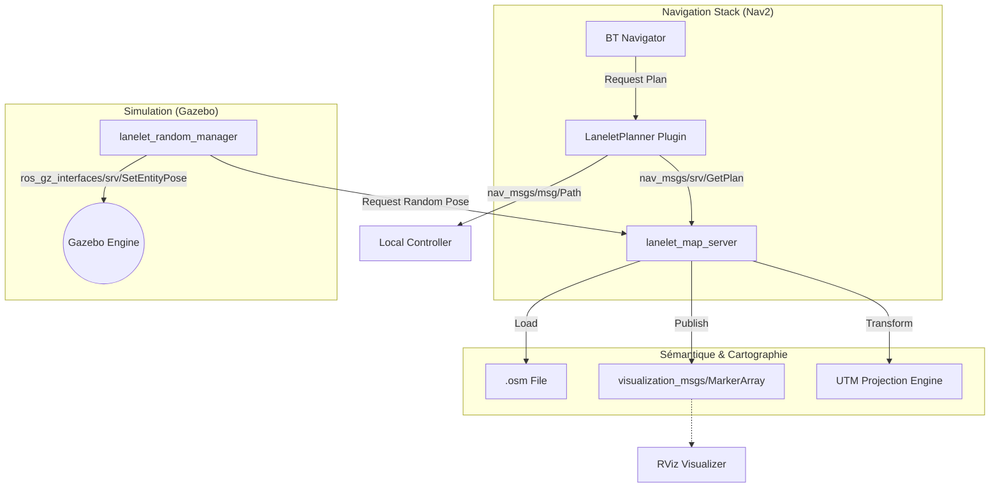

# graphes

```mermaid
graph TD
    subgraph "Navigation Stack (Nav2)"
        BT[BT Navigator] --> |Request Plan| LP[LaneletPlanner Plugin]
        LP --> |nav_msgs/srv/GetPlan| LMS
    end

    subgraph "Sémantique & Cartographie"
        LMS[lanelet_map_server] --> |Load| OSM[.osm File]
        LMS --> |Publish| VM[visualization_msgs/MarkerArray]
        LMS --> |Transform| UTM[UTM Projection Engine]
    end

    subgraph "Simulation (Gazebo)"
        LRM[lanelet_random_manager] --> |Request Random Pose| LMS
        LRM --> |ros_gz_interfaces/srv/SetEntityPose| GZ((Gazebo Engine))
    end

    VM -.-> RViz[RViz Visualizer]
    LP --> |nav_msgs/msg/Path| Controller[Local Controller]
```
