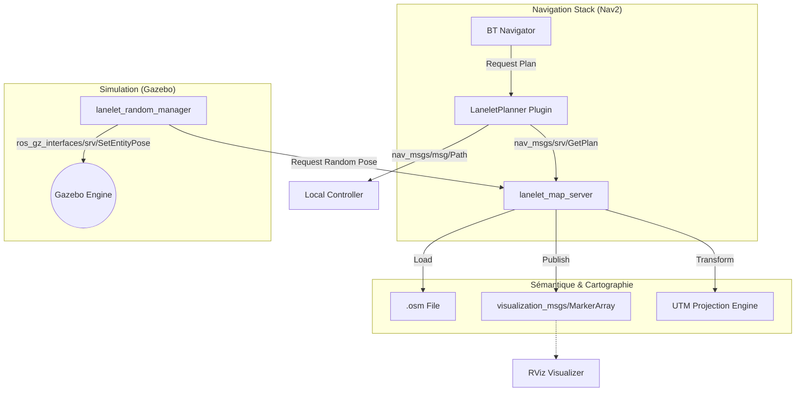
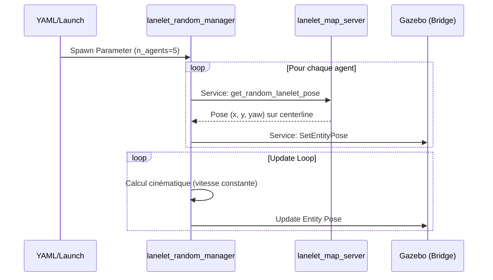
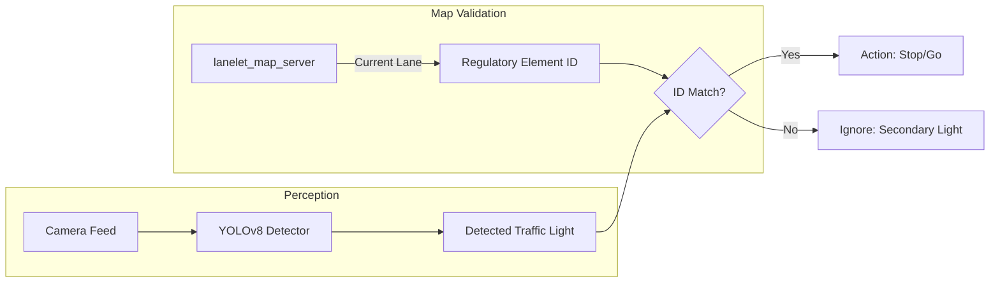
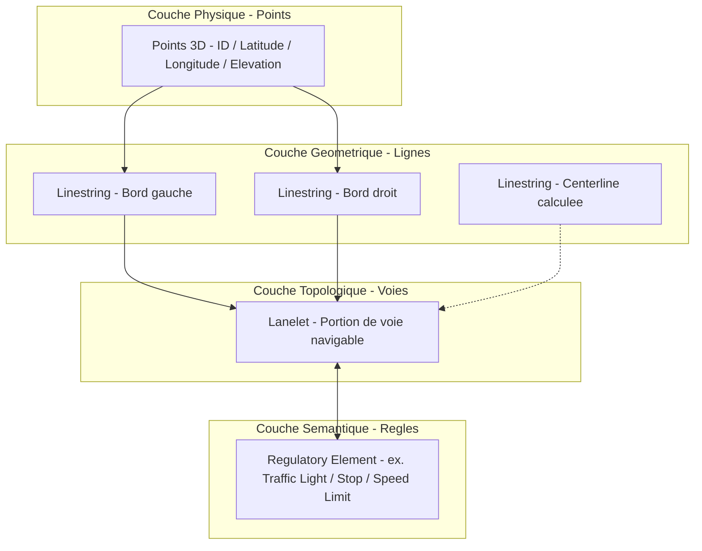
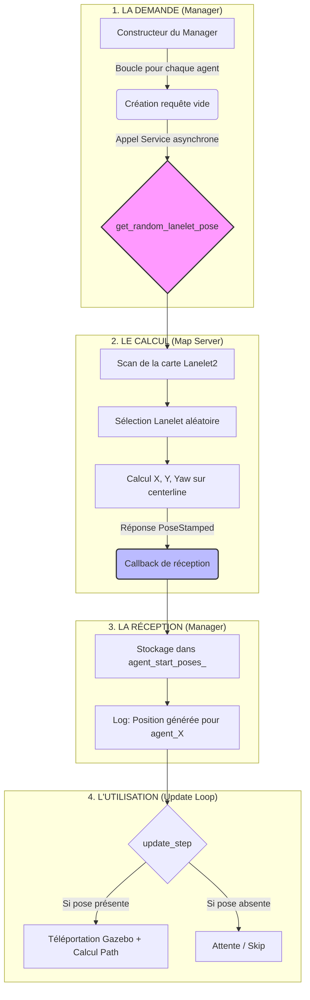
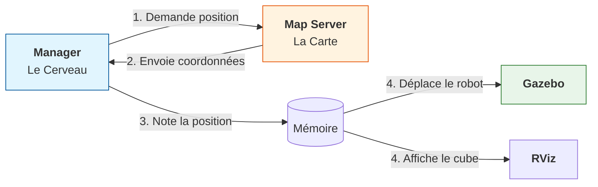

# graphes















```mermaid
graph TD
    A[<b>Départ</b><br/>Besoin d'un Goal] --> B{Parcourir la Carte}
    B --> C[Liste des routes valides (Lanelets)]
    C --> D[<b>Tirage au sort</b><br/>std::mt19937</b>]
    D --> E[Route choisie au hasard]
    E --> F[Point au milieu de la ligne (index size/2)]
    F --> G[Calculer l'angle de la route]
    G --> H[<b>Goal Validé</b><br/>X, Y, Yaw</b>]

    style D fill:#fff3e0,stroke:#e65100,stroke-width:2px
    style H fill:#e8f5e9,stroke:#2e7d32,stroke-width:2px
```