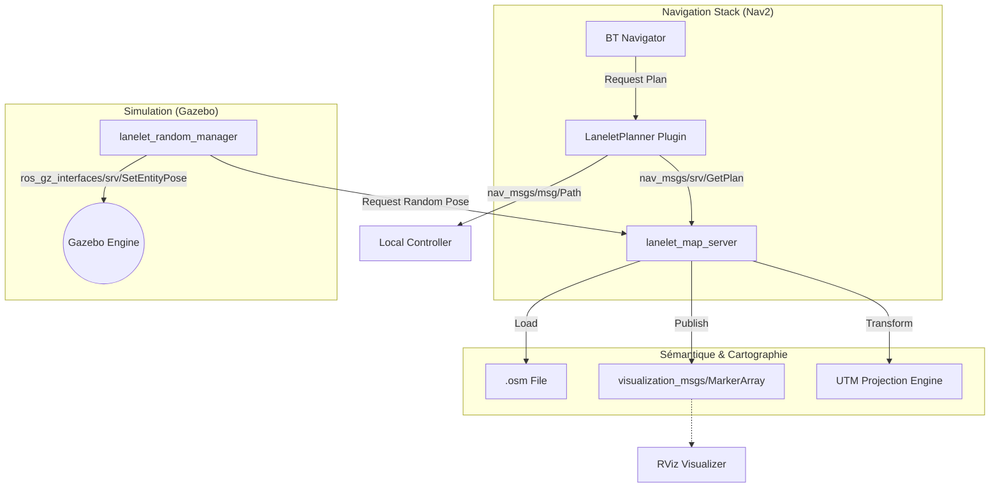
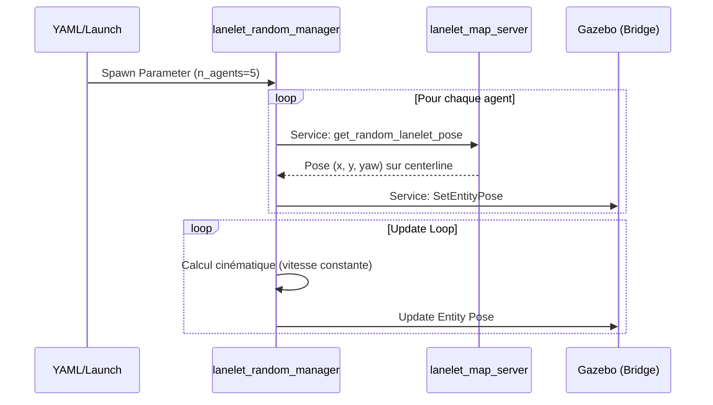
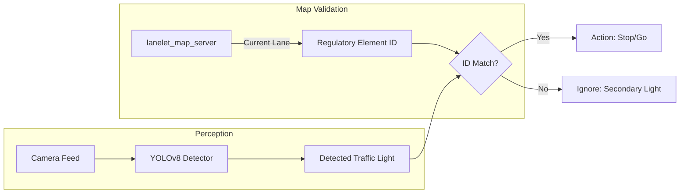

# graphes

```mermaid
graph TD
    subgraph "Navigation Stack (Nav2)"
        BT[BT Navigator] --> |Request Plan| LP[LaneletPlanner Plugin]
        LP --> |nav_msgs/srv/GetPlan| LMS
    end

    subgraph "Sémantique & Cartographie"
        LMS[lanelet_map_server] --> |Load| OSM[.osm File]
        LMS --> |Publish| VM[visualization_msgs/MarkerArray]
        LMS --> |Transform| UTM[UTM Projection Engine]
    end

    subgraph "Simulation (Gazebo)"
        LRM[lanelet_random_manager] --> |Request Random Pose| LMS
        LRM --> |ros_gz_interfaces/srv/SetEntityPose| GZ((Gazebo Engine))
    end

    VM -.-> RViz[RViz Visualizer]
    LP --> |nav_msgs/msg/Path| Controller[Local Controller]
```

```mermaid
sequenceDiagram
    participant Config as YAML/Launch
    participant LRM as lanelet_random_manager
    participant LMS as lanelet_map_server
    participant GZ as Gazebo (Bridge)

    Config->>LRM: Spawn Parameter (n_agents=5)
    loop Pour chaque agent
        LRM->>LMS: Service: get_random_lanelet_pose
        LMS-->>LRM: Pose (x, y, yaw) sur centerline
        LRM->>GZ: Service: SetEntityPose
    end
    loop Update Loop
        LRM->>LRM: Calcul cinématique (vitesse constante)
        LRM->>GZ: Update Entity Pose
    end
```

```mermaid
graph LR
    subgraph "Perception"
        Cam[Camera Feed] --> YOLO[YOLOv8 Detector]
        YOLO --> Det[Detected Traffic Light]
    end

    subgraph "Map Validation"
        LMS[lanelet_map_server] --> |Current Lane| RE[Regulatory Element ID]
        RE --> Match{ID Match?}
    end

    Det --> Match
    Match -->|Yes| Control[Action: Stop/Go]
    Match -->|No| Ignore[Ignore: Secondary Light]
```
