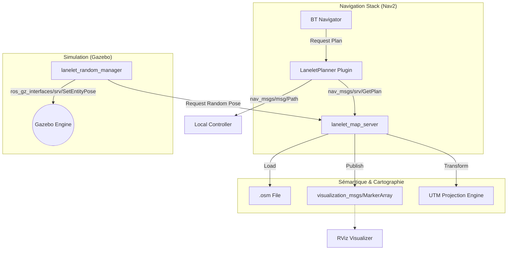
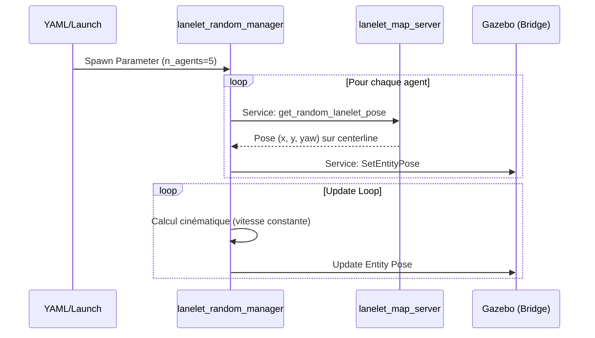
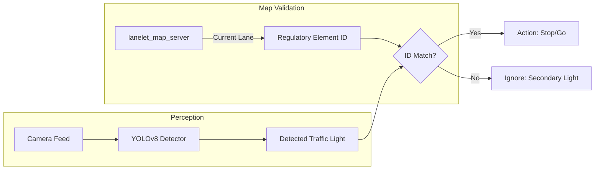
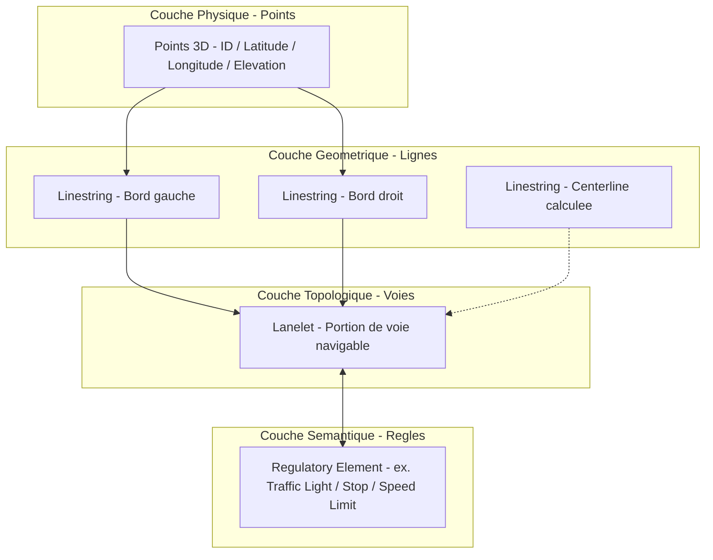
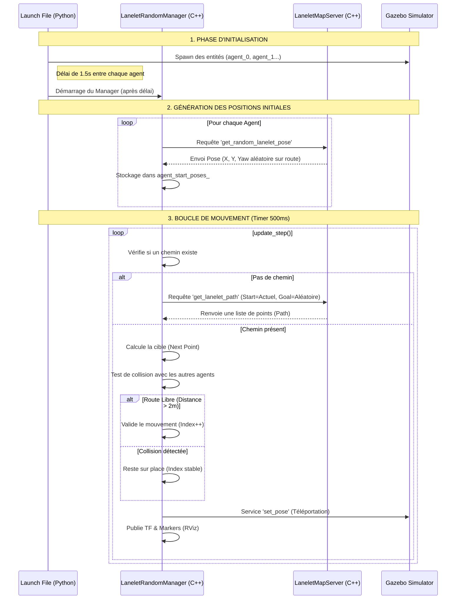

# graphes

```mermaid
graph TD
    subgraph "Navigation Stack (Nav2)"
        BT[BT Navigator] --> |Request Plan| LP[LaneletPlanner Plugin]
        LP --> |nav_msgs/srv/GetPlan| LMS
    end

    subgraph "Sémantique & Cartographie"
        LMS[lanelet_map_server] --> |Load| OSM[.osm File]
        LMS --> |Publish| VM[visualization_msgs/MarkerArray]
        LMS --> |Transform| UTM[UTM Projection Engine]
    end

    subgraph "Simulation (Gazebo)"
        LRM[lanelet_random_manager] --> |Request Random Pose| LMS
        LRM --> |ros_gz_interfaces/srv/SetEntityPose| GZ((Gazebo Engine))
    end

    VM -.-> RViz[RViz Visualizer]
    LP --> |nav_msgs/msg/Path| Controller[Local Controller]
```

```mermaid
sequenceDiagram
    participant Config as YAML/Launch
    participant LRM as lanelet_random_manager
    participant LMS as lanelet_map_server
    participant GZ as Gazebo (Bridge)

    Config->>LRM: Spawn Parameter (n_agents=5)
    loop Pour chaque agent
        LRM->>LMS: Service: get_random_lanelet_pose
        LMS-->>LRM: Pose (x, y, yaw) sur centerline
        LRM->>GZ: Service: SetEntityPose
    end
    loop Update Loop
        LRM->>LRM: Calcul cinématique (vitesse constante)
        LRM->>GZ: Update Entity Pose
    end
```

```mermaid
graph LR
    subgraph "Perception"
        Cam[Camera Feed] --> YOLO[YOLOv8 Detector]
        YOLO --> Det[Detected Traffic Light]
    end

    subgraph "Map Validation"
        LMS[lanelet_map_server] --> |Current Lane| RE[Regulatory Element ID]
        RE --> Match{ID Match?}
    end

    Det --> Match
    Match -->|Yes| Control[Action: Stop/Go]
    Match -->|No| Ignore[Ignore: Secondary Light]
```

```mermaid
graph TD
    subgraph Couche_Semantique [Couche Semantique - Regles]
        RE[Regulatory Element - ex. Traffic Light / Stop / Speed Limit]
    end

    subgraph Couche_Topologique [Couche Topologique - Voies]
        LL[Lanelet - Portion de voie navigable]
    end

    subgraph Couche_Geometrique [Couche Geometrique - Lignes]
        LS_L[Linestring - Bord gauche]
        LS_R[Linestring - Bord droit]
        LS_C[Linestring - Centerline calculee]
    end

    subgraph Couche_Physique [Couche Physique - Points]
        P[Points 3D - ID / Latitude / Longitude / Elevation]
    end

    %% Relations
    P --> LS_L
    P --> LS_R
    LS_L --> LL
    LS_R --> LL
    LS_C -.-> LL
    LL <--> RE
```

```mermaid
sequenceDiagram
    participant Launch as Launch File (Python)
    participant Manager as LaneletRandomManager (C++)
    participant Server as LaneletMapServer (C++)
    participant GZ as Gazebo Simulator

    Note over Launch, GZ: 1. PHASE D'INITIALISATION
    Launch->>GZ: Spawn des entités (agent_0, agent_1...)
    Note right of Launch: Délai de 1.5s entre chaque agent
    Launch->>Manager: Démarrage du Manager (après délai)

    Note over Launch, GZ: 2. GÉNÉRATION DES POSITIONS INITIALES
    loop Pour chaque Agent
        Manager->>Server: Requête 'get_random_lanelet_pose'
        Server-->>Manager: Envoi Pose (X, Y, Yaw aléatoire sur route)
        Manager->>Manager: Stockage dans agent_start_poses_
    end

    Note over Launch, GZ: 3. BOUCLE DE MOUVEMENT (Timer 500ms)
    loop update_step()
        Manager->>Manager: Vérifie si un chemin existe
        alt Pas de chemin
            Manager->>Server: Requête 'get_lanelet_path' (Start=Actuel, Goal=Aléatoire)
            Server-->>Manager: Renvoie une liste de points (Path)
        else Chemin présent
            Manager->>Manager: Calcule la cible (Next Point)
            Manager->>Manager: Test de collision avec les autres agents
            
            alt Route Libre (Distance > 2m)
                Manager->>Manager: Valide le mouvement (Index++)
            else Collision détectée
                Manager->>Manager: Reste sur place (Index stable)
            end

            Manager->>GZ: Service 'set_pose' (Téléportation)
            Manager->>Manager: Publie TF & Markers (RViz)
        end
    end
```